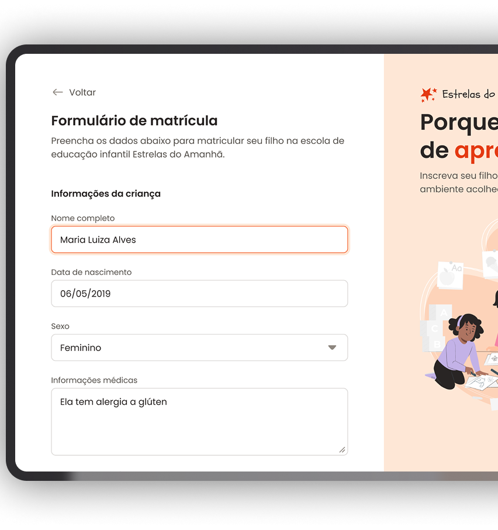

# 🌟 Estrelas do Amanhã - Formulário de Matrícula

  

 Projeto desenvolvido para facilitar a matrícula de crianças na escola de educação infantil. O objetivo é proporcionar uma experiência intuitiva e acessível para os responsáveis realizarem a inscrição dos alunos.

 
  

## 🚀 Tecnologias
Esse projeto foi desenvolvido com as seguintes tecnologias:
- <strong>HTML</strong>
- <strong>CSS</strong>
